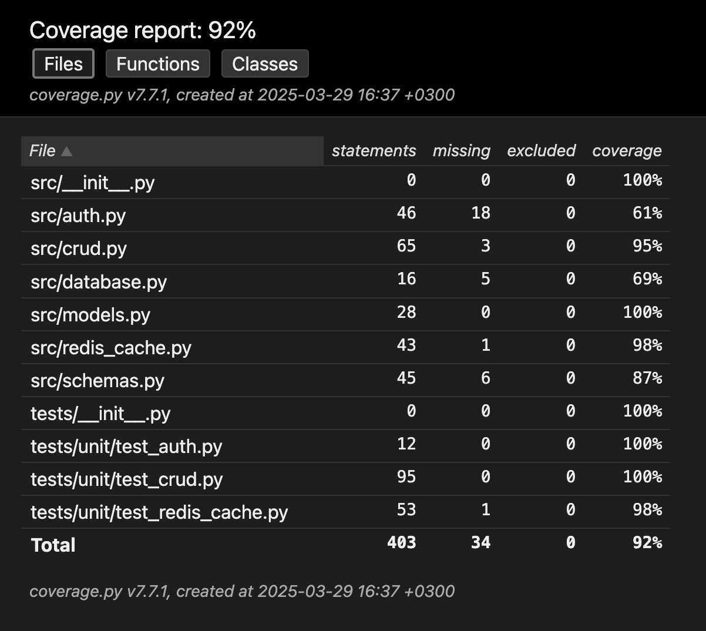

## Описание проекта
Сервис для сокращения URL-адресов с возможностью:
- Авторизации пользователей
- Создания временных ссылок
- Просмотра статистики переходов
- Управления своими ссылками

## Технологии
- Python + FastAPI
- PostgreSQL (основное хранилище)
- Redis (кэширование)
- Docker (развертывание)

## API Endpoints

### 1. Аутентификация

#### POST `/register`
**Назначение**: Регистрация нового пользователя   

```bash
curl -X POST "https://shortlink-zv2s.onrender.com/register" \
-H "Content-Type: application/json" \
-d '{"email": "user@example.com", "password": "securepassword"}'
```


#### POST  `/token`

**Назначение**: Получение JWT токена

```bash
curl -X POST "https://shortlink-zv2s.onrender.com/token" \
-H "Content-Type: application/x-www-form-urlencoded" \
-d "username=user@example.com&password=securepassword"
```


### 2. Работа со ссылками

#### POST  `/links/shorten`

**Назначение**: Создание сокращенной ссылки

```bash
curl -X POST "https://shortlink-zv2s.onrender.com/links/shorten" \
-H "Authorization: Bearer <your_jwt_token>" \
-H "Content-Type: application/json" \
-d '{"original_url": "https://example.com/very/long/url"}'
```

#### GET  `/{short_code}`

**Назначение**: Перенаправление по короткой ссылке

```bash
curl -X GET "https://shortlink-zv2s.onrender.com/abc123" -v
```

#### GET  `/links/{short_code}/stats`

**Назначение**: Получение статистики по ссылке

```bash
curl -X GET "https://shortlink-zv2s.onrender.com/links/abc123/stats" \
-H "Authorization: Bearer <your_jwt_token>"
```

#### PUT  `/links/{short_code}`

**Назначение**: Обновление ссылки

```bash
curl -X PUT "https://shortlink-zv2s.onrender.com/links/abc123" \
-H "Authorization: Bearer <your_jwt_token>" \
-H "Content-Type: application/json" \
-d '{"original_url": "https://new-url.com"}'
```

#### DELETE  `/links/{short_code}`

**Назначение**: Удаление ссылки

```bash
curl -X DELETE "https://shortlink-zv2s.onrender.com/links/abc123" \
-H "Authorization: Bearer <your_jwt_token>"
```

### 3. Управление пользовательскими ссылками

#### GET  `/users/me/links`

**Назначение**: Получение всех ссылок пользователя

```bash
curl -X GET "https://shortlink-zv2s.onrender.com/users/me/links" \
-H "Authorization: Bearer <your_jwt_token>"
```

### 4. Администрирование

API предоставляет несколько специальных эндпоинтов для административных задач:

#### DELETE `/links/cleanup/expired`
**Назначение**: Массовое удаление всех истекших ссылок

```bash
curl -X DELETE "https://shortlink-zv2s.onrender.com/links/cleanup/expired" \
-H "Authorization: Bearer <admin_token>"
```


#### GET  `/links/expired/history`

**Назначение**: Просмотр истории истекших ссылок

```bash
curl -X GET "https://shortlink-zv2s.onrender.com/links/expired/history" \
-H "Authorization: Bearer <admin_token>"
```

#### GET `/links/search`
**Назначение**: Поиск существующей короткой ссылки по оригинальному URL


```bash
curl -X GET "https://shortlink-zv2s.onrender.com/links/search?original_url=https://example.com/long/url" \
-H "Authorization: Bearer <your_jwt_token>"
```

## Модели базы данных

### Таблица `users`
| Поле            | Тип       | Описание                     |
|-----------------|-----------|------------------------------|
| id             | Integer   | Первичный ключ               |
| email          | String    | Уникальный email пользователя|
| hashed_password| String    | Хэшированный пароль          |
| created_at     | DateTime  | Дата регистрации             |

### Таблица `links`
| Поле          | Тип       | Описание                      |
|--------------|-----------|-------------------------------|
| id           | Integer   | Первичный ключ                |
| original_url | String    | Оригинальный URL              |
| short_code   | String    | Уникальный короткий код       |
| created_at   | DateTime  | Дата создания                 |
| expires_at   | DateTime  | Дата истечения срока (опционально)|
| user_id      | Integer   | Внешний ключ на пользователя  |

### Таблица `link_stats`
| Поле          | Тип       | Описание                      |
|--------------|-----------|-------------------------------|
| id           | Integer   | Первичный ключ                |
| link_id      | Integer   | Внешний ключ на ссылку        |
| clicks       | Integer   | Количество переходов          |
| last_clicked_at| DateTime | Дата последнего перехода      |


## Роль Redis в проекте

Redis в этом проекте выполняет две ключевые функции:

### 1. Кэширование результатов запросов

-   Используется декоратор  `@redis_cache`  для кэширования ответов API
    
-   Например, при перенаправлении по короткой ссылке (`GET /{short_code}`) результат кэшируется на 60 секунд
    
-   Это значительно снижает нагрузку на базу данных при частых запросах к популярным ссылкам
    

### 2. Инвалидация кэша

-   При изменении или удалении ссылки используется декоратор  `@cache_invalidate`
    
-   Он очищает все закэшированные данные, связанные с изменяемой ссылкой
    
-   Это обеспечивает актуальность данных после изменений


## Инструкция по запуску

1.  Убедитесь, что у вас установлены Docker и Docker Compose
    
2.  Клонируйте репозиторий

4.  Запустите сервисы:
    
```bash    
docker-compose up -d --build
```
    
5.  Приложение будет доступно по адресу  `http://localhost:8000`


## Демонстрационный сервис по адресу https://shortlink-zv2s.onrender.com 

## Тестирование

Проект был полностью покрыт автоматическими тестами, включая:

### 🔍 Юнит-тесты
- Написаны с использованием **pytest** 
- Мокирование зависимостей через **pytest-mock**
- Проверка работы с паролями через **bcrypt**


# Запуск тестов с измерением покрытия
```bash
pytest --cov=src --cov-report=html
```


### Нагрузочное тестирование

-   Проведено с помощью  **Locust**
    
-   Тестировались основные сценарии:
    
    -   Создание коротких ссылок
        
    -   Редиректы
        
    -   Получение статистики
        

```bash
locust -f tests/load_test.py --host http://localhost:8000
```

## 📊 Test Coverage Report



**Total Coverage: 92%**


